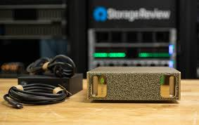

# Hi there , I'm Carlos Daniel

  

## 👨🏻‍💻 About me :

I work at the intersection of AI and MLOps, focusing my efforts on scalability, performance, and efficiency, in both Language Models (LLMs) and Classical Machine Learning. My research centers on Edge Computing, as well as statistical modeling applied to Machine Learning, and to a lesser extent, the acceleration of training and workflows using GPUs

  

  🤖 Data scientist | AI Engineer Experience 

    <ul>
    <li>More than 12 years of experience in Machine Learning and AI in top organizations in the United States and Latin America, across industries such as: Banking, Healthcare, Retail, Entertainment, and Human Resources.</li>
    <li>More than 30 products developed from scratch and deployed into production</li>
    <li>Former developer of packages or libraries in R.</li>
    <li>I focus the development of ML models with statistical applications.</li>
    <li>I constantly think about Design Systems for solution development.</li>
    <li>Expert in MLOps, Automation, and the design of custom solutions.</li>

  

  👨🏻‍🏫 Academic Experience 

<li>I have been a professor in Colombia, México, Perú, Chile, and Spain.</li>
<li>The subjects I generally teach are: Machine Learning, Applied Statistics for Data Science, and Bayesian Statistics.</li>

  🦿 Edge Computing and Robotics 

<li>I work with the Raspberry Pi (5) on topics related to AI Programming and Computer Vision-based Robotics.</li>
<li>With the Jetson Nano, I work with language models</li>

  

<!--END_SECTION:waka-->

 

## 👨🏻‍💼 Conferences & Talks

For a long time, my work focused on the statistical side, and therefore you will find many talks focused on R. Recently, I have been speaking a lot about Machine Learning focused on DevOps or AI applied to different disciplines, with these recent talks developed in Python. You can find an organized list of all these topics at the following link. <https://github.com/carlosjimenez88M/talks>

## 🧑🏻‍🏫 Courses

At the following link, you will find some of the classes I have taught and can share.
<https://github.com/carlosjimenez88M/Courses>

## 📱 Talk to me!

Feel free to contact me or reach out through any of these means:

* [Linkedin](https://www.linkedin.com/in/djimenezm/)

* [Twitter](https://twitter.com/DanielJimenezM9)