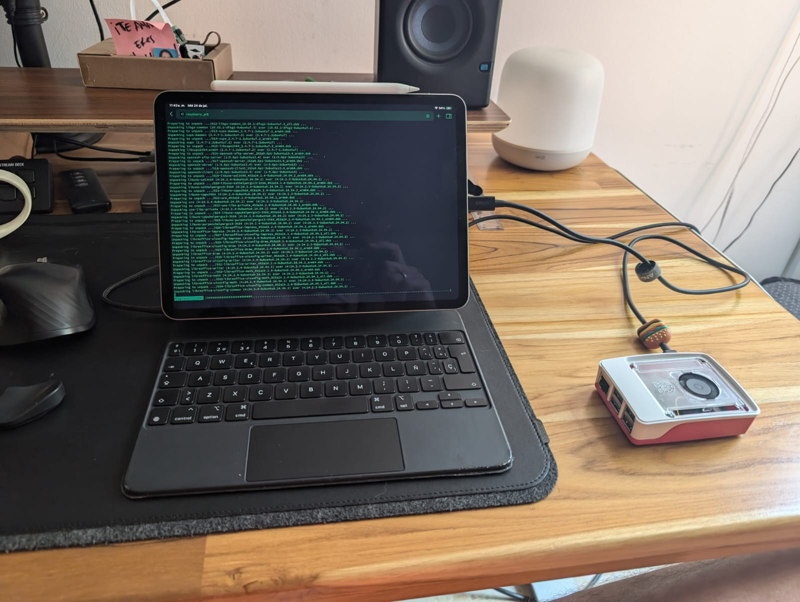

# Hi there  </samp>, I 'm Carlos Daniel

## 👨🏻‍💻 About me :

Software AI Engineer with a focus on MLOps, LLMs, statistical applications in Machine Learning, and time series. Passionate about Edge and Cloud Computing, AI programming, and the Nvidia technology stack.

## 👨🏻‍💻 Work areas:

  

      

* Machine Learning Devops Engineering 
* GitOps
* LLMs, Rags and MCPs
* Yolo - Computer Vision 
* Docker - Kubernetes
* FastAPI
* MLflow

## 🤖 Successfully implemented products:

* __I developed an OCR model for a financial entity__ that, in addition to extracting information and storing it in a database, performs calculations on the extracted data. These calculations are then used as inputs for a recommendation system.

* __30 Comprehensive NLP Projects:__ Developed for risk assessment, project evaluation, structuring medical records, classifying resume segments, and generating news context.

* __Computer Vision Project:__ Implemented a system for product identification on shelves.

* __3 Deep Learning Time Series Models:__ Designed for demand planning, predicting changes in product trends, and detecting failures in security equipment.

* __Over 20 Machine Learning Projects:__ Executed in various domains including retail, pricing, product categorization, and more.

<!--END_SECTION:waka-->

 

## 🐎 Workhorse

For at least a year, to optimize my work as a Machine Learning DevOps Engineer and streamline my activities, I adopted the strategy of working with a Raspberry Pi connected to my iPad, and honestly, I love it!

## 👨🏻‍💼 Conferences  Talks

For a long time, my work focused on the statistical side, and therefore you will find many talks focused on R. Recently, I have been speaking a lot about Machine Learning focused on DevOps or AI applied to different disciplines, with these recent talks developed in Python. You can find an organized list of all these topics at the following link. <https://github.com/carlosjimenez88M/talks>

## 🧑🏻‍🏫 Courses

At the following link, you will find some of the classes I have taught and can share.
<https://github.com/carlosjimenez88M/Courses>

## 📱 Talk to me!

Feel free to contact me or reach out through any of these means:

* [Linkedin](https://www.linkedin.com/in/djimenezm/)

* [Twitter](https://twitter.com/DanielJimenezM9)